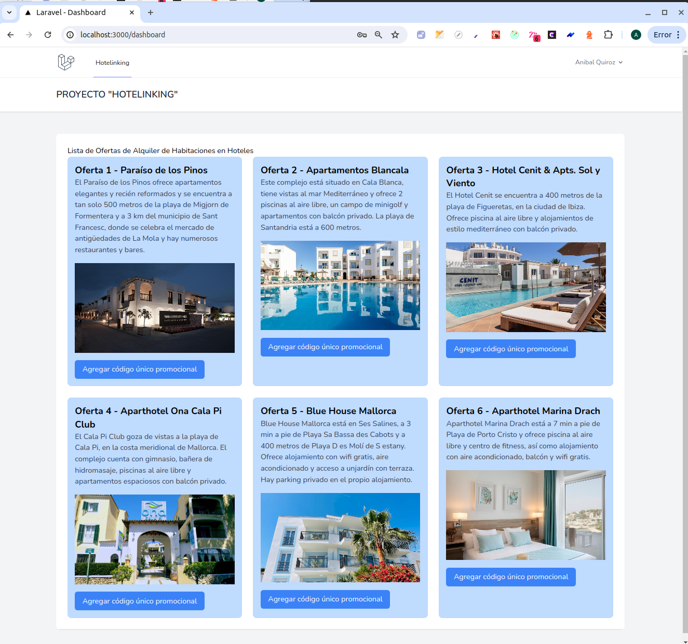

## Alcance y estado de este software

El objetivo de  este software es únicamente para fines demostrativos como resultado de una prueba técnica. 

## Hotelinking-Front-v1.0

En la implementación de este frontend se usó el framework NextJs 14, Tailwind, Javascript. La estructura básica de este frontend fué extraida (por sugerencia del sitio oficial de Laravel) del repositorio https://github.com/laravel/breeze-next

Para el funcionamiento de este frontend, es necesario tener instalado NodeJs y Git 

El código de este frontend solo está probado en modo developer, por lo tanto la forma de lanzar el front es:

carpeta correspondiente/Hotelinkig-front$ npm run dev

al ejecutar este comando en la terminal de visualizará el siguiente mensaje:

   > breeze-next@0.1.0 dev
> next dev

  ▲ Next.js 14.2.3
  - Local:        http://localhost:3000
  - Environments: .env.local

 ✓ Starting...
 ✓ Ready in 2.4s

  Y ese mensaje indica que el front está corriendo. Se puede hacer cntrl+enter con el mouse sobre " http://localhost:3000" y se abrirá en el browser una página con la opcion de Login y Register.
  Al registrarse y loguearse el usuario será redirigido a la página principal, en la cual teniendo los datos de la base de datos en uso, se podrá ver en la página lo siguiente: 

  

  Los botones indicados con el texto "Agregar código único promocional" n tienen implementada su función.